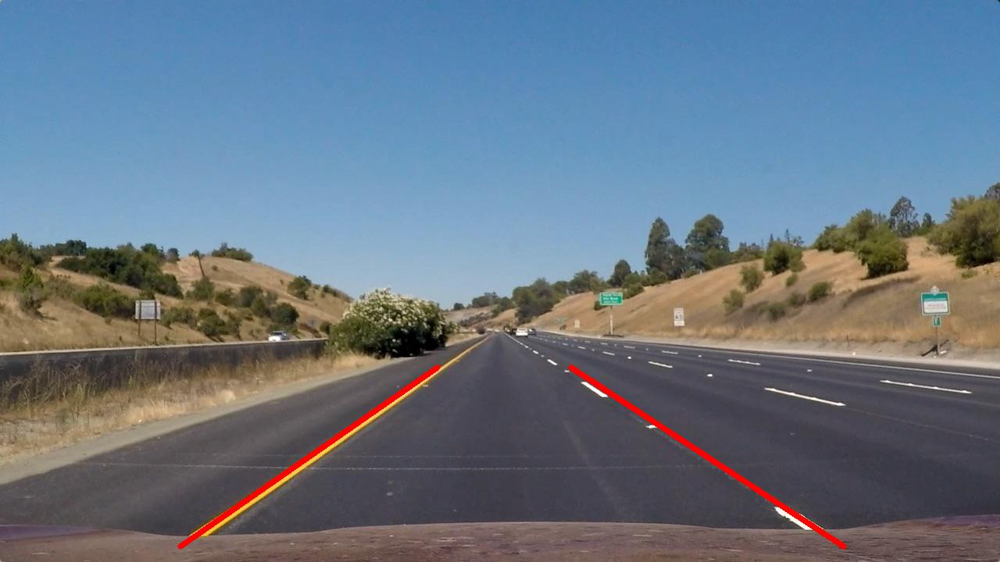
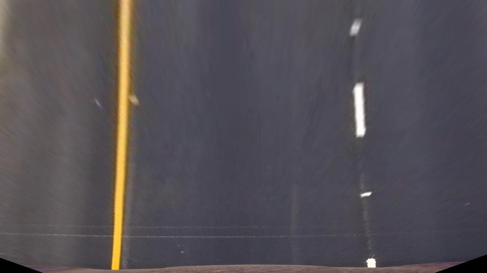
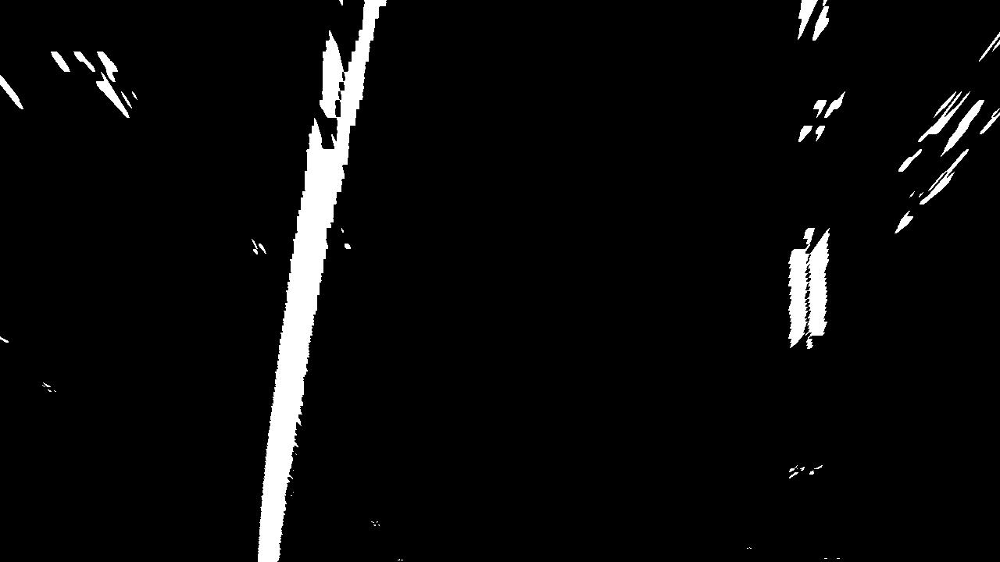
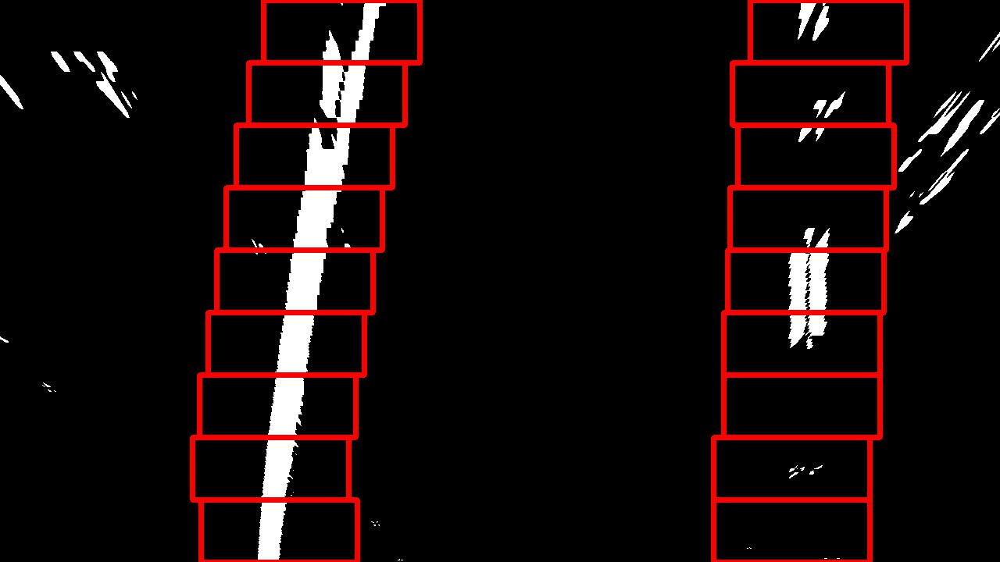
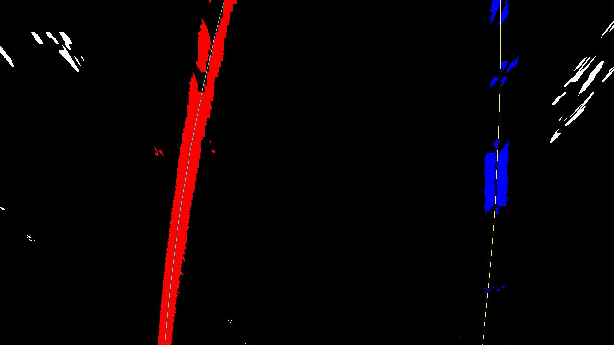
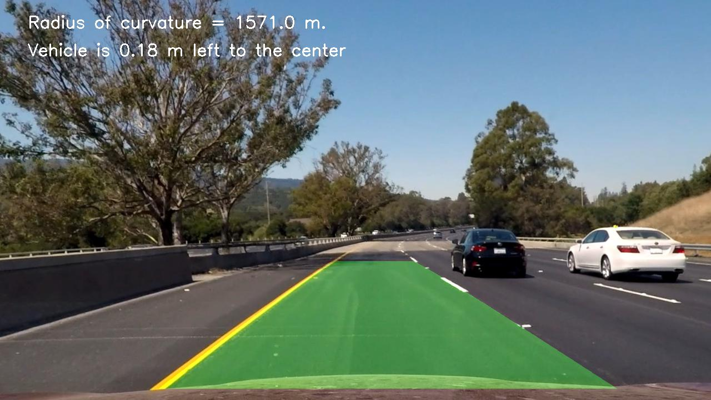

**Advanced Lane Finding Project**

The goals / steps of this project are the following:

* Compute the camera calibration matrix and distortion coefficients given a set of chessboard images.
* Apply a distortion correction to raw images.
* Use color transforms, gradients, etc., to create a thresholded binary image.
* Apply a perspective transform to rectify binary image ("birds-eye view").
* Detect lane pixels and fit to find the lane boundary.
* Determine the curvature of the lane and vehicle position with respect to center.
* Warp the detected lane boundaries back onto the original image.
* Output visual display of the lane boundaries and numerical estimation of lane curvature and vehicle position.

[//]: # (Image References)

[original]: ./writeup_imgs/1.calibration1.jpg  "Original"
[undist]: ./writeup_imgs/1.undist_cali.jpg "Undistorted"

[pipeline_test]: ./writeup_imgs/pipeline_test.jpg "Pipeline test img"


[ver_grad]: ./writeup_imgs/4.ver_grad_bin.jpg "vertical grad"
[dir_grad]: ./writeup_imgs/4.dir_grad_bin.jpg "directional grad"
[combined_grad]: ./writeup_imgs/4.combined_grad_bin.jpg "combined grad"

[gray_bin]: ./writeup_imgs/4.gray_bin.jpg "gray bin"
[hls_bin]: ./writeup_imgs/4.hls_bin.jpg "hls bin"
[combined_color]: ./writeup_imgs/4.combined_color_bin.jpg "combined color bin"

[combined_bin]: ./writeup_imgs/4.combined_bin.jpg "combined bin"

[video1]: ./project_video.mp4 "Video"

## [Rubric](https://review.udacity.com/#!/rubrics/571/view) Points

### Here I will consider the rubric points individually and describe how I addressed each point in my implementation.  

---

All the code are located in `Advanced Lane Finding.ipynb`

### Camera Calibration

#### 1. Briefly state how you computed the camera matrix and distortion coefficients. Provide an example of a distortion corrected calibration image.

Code for getting the camera matrix and distortion coefficients is located in `getCalibrateMtx()`, I also defined `distCorrection(img)` to correct a given image based on those values.

I start by preparing "object points", which will be the (x, y, z) coordinates of the chessboard corners in the world. Here I am assuming the chessboard is fixed on the (x, y) plane at z=0, such that the object points are the same for each calibration image.  Thus, `objp` is just a replicated array of coordinates, and `objpoints` will be appended with a copy of it every time I successfully detect all chessboard corners in a test image.  `imgpoints` will be appended with the (x, y) pixel position of each of the corners in the image plane with each successful chessboard detection.  

I then used the output `objpoints` and `imgpoints` to compute the camera calibration and distortion coefficients using the `cv2.calibrateCamera()` function.  I applied this distortion correction to the test image using the `cv2.undistort()` function and obtained this result: 

![original] ![undist]

### Pipeline (single images)

#### 1. Provide an example of a distortion-corrected image.

To demonstrate this step, I will describe how I apply the distortion correction to one of the test images like this one:
![pipeline_test]

#### 2. Describe how (and identify where in your code) you used color transforms, gradients or other methods to create a thresholded binary image.  Provide an example of a binary image result.

I used a combination of color and gradient thresholds to generate a binary image.

I used `vertical_grad_thresh()`, `dir_grad_threshold()`, `gray_color_threshold()` and `hls_color_threshold()` to calculate the binary threshold images with different criterias, then in `processImg()` I combined the results into a single binary threshold image.

Here're are the two separate gradient bin images (vertical gradient bin and directional gradient bin):
![ver_grad] ![dir_grad]
along with their combined result:
![combined_grad]

Here're are the two separate color threshold bin images (gray bin and hls bin):
![gray_bin] ![hls_bin]
along with their combined result:
![combined_color]

And their overall combined result:
![combined_bin]


#### 3. Describe how (and identify where in your code) you performed a perspective transform and provide an example of a transformed image.

I used a helper method `matchLaneLines()` to draw out 2 lines for the selected points on the image for perspective transformation. I manually picked `(560, 470), (230, 700), (730, 470), (1080, 700)` as the src points, where the corresponding lines shown on the image looks like  After fixing these points, I used `getPerspectiveM(image_shape)` to get the transformation matrix (and the inverse of that for later). This is how I get the dst points, where I set `margin=300` to leave some space on both sides after the perspective transformation.

```python
[margin, 0],
[image_shape[1]-margin, 0],
[margin, image_shape[0]],
[image_shape[1]-margin, image_shape[0]]
```

This resulted in the following source and destination points:

| Source        | Destination   | 
|:-------------:|:-------------:| 
| 560, 470      | 300, 0        | 
| 730, 470      | 980, 0        |
| 230, 700      | 300, 720      |
| 1080, 700     | 980, 720      |

I verified that my perspective transform was working as expected by drawing the `src` and `dst` points onto a test image and its warped counterpart to verify that the lines appear parallel in the warped image.



#### 4. Describe how (and identify where in your code) you identified lane-line pixels and fit their positions with a polynomial?

With the perspective transformation matrics and the processed binary image, I got the rectified lane binary image for the test image with `prespetiveTransform(img)`


With sliding window method (`slidingWindow`), I'm able to group pixels for both lanes and matched polynomials for those pixels.
 

For later images in the sequence, I added some methods to make the result more stable

1. When fitting polynomials, on top of the pixels found in the current image, I also mix in some points on the line for the currently fitted lane as an anchor to make sure the new detecteed lane line won't drift away dramatically.

2. I also used the average of the last 5 fitted lines as the prediction for the lane lines to smooth out.

#### 5. Describe how (and identify where in your code) you calculated the radius of curvature of the lane and the position of the vehicle with respect to center.

In `visualize()`, around the middle, I caculated the curvature and car's relative position to the lane.
It's basically rescale the fitted line with the relative x,y axis meter per pixel ratio to get the coefficients for the real life lane line polynomials, then apply the curvature formular on rescaled y value for the bottom of the image (that's where the car is the closest to).

As for the car's relative position to the lane, we can find out the intersection points for both lane lines with the bottom of the image, the middle point of that would be the lane center, and based on the assumption that camera is mounted in the middle (car is at the center of the image), we can find out how far we are from the center.


#### 6. Provide an example image of your result plotted back down onto the road such that the lane area is identified clearly.

I used `visualize(undist, binary_warped, left_lane, right_lane)` to calculate the curvatures, offcenter distance, and draw found lane areas back to the image, here's a sample


---

### Pipeline (video)

#### 1. Provide a link to your final video output.  Your pipeline should perform reasonably well on the entire project video (wobbly lines are ok but no catastrophic failures that would cause the car to drive off the road!).

Here's a [link to my video result](videos_output/proj.mp4)

---

### Discussion

#### 1. Briefly discuss any problems / issues you faced in your implementation of this project.  Where will your pipeline likely fail?  What could you do to make it more robust?

The combined binary image result is not always ideal, in conditions where lighting/shadow contrast is dramatic and where the road has patches, my result could be noisy and the rectified binary image may present insufficient signals for lane detection

There should be a way to make use of the fact that two lane lines should be parallel to each other but I didn't find a good way to.

As described above, I mixed in points from previously detected lane lines to the newly detected pixels for line fitting to stablize the lane matching, that works well for relatively straight road, but that actually makes the result less flexible. In the hard challenge video, this slows down how fast the detected lane can change it's direction.

To improve:

1. Need more tuning for the threshold parameters for more robust binary encoding
2. reduce the number of points I sample from previously detected lane, and have some validation methods when the lane changes direction a lot (like if both matched lanes have the same direction, it's less likely a mistake)