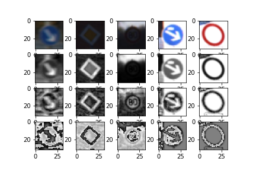
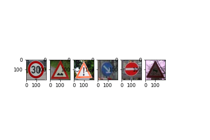

# **Traffic Sign Recognition** 

## Writeup

**Build a Traffic Sign Recognition Project**

The goals / steps of this project are the following:
* Load the data set (see below for links to the project data set)
* Explore, summarize and visualize the data set
* Design, train and test a model architecture
* Use the model to make predictions on new images
* Analyze the softmax probabilities of the new images
* Summarize the results with a written report

[//]: # (Image References)

[image1]: ./examples/visualization.jpg "Visualization"
[image2]: ./examples/grayscale.jpg "Grayscaling"
[image3]: ./examples/random_noise.jpg "Random Noise"
[image4]: ./examples/placeholder.png "Traffic Sign 1"
[image5]: ./examples/placeholder.png "Traffic Sign 2"
[image6]: ./examples/placeholder.png "Traffic Sign 3"
[image7]: ./examples/placeholder.png "Traffic Sign 4"
[image8]: ./examples/placeholder.png "Traffic Sign 5"

## Rubric Points
### Here I will consider the [rubric points](https://review.udacity.com/#!/rubrics/481/view) individually and describe how I addressed each point in my implementation.  

---
### Data Set Summary & Exploration

#### 1. Provide a basic summary of the data set. In the code, the analysis should be done using python, numpy and/or pandas methods rather than hardcoding results manually.

I loaded dataset and got the basic summary through getting the shape and basic len() funcion

* Number of training examples = 34799
* Number of validation examples = 4410
* Number of testing examples = 12630
* Image data shape = (32, 32, 3)
* Number of classes = 43

#### 2. Include an exploratory visualization of the dataset.

Here is histogram showing how test images are distributed across different labels.

### Design and Test a Model Architecture

#### 1. Describe how you preprocessed the image data. What techniques were chosen and why did you choose these techniques? Consider including images showing the output of each preprocessing technique. Pre-processing refers to techniques such as converting to grayscale, normalization, etc. (OPTIONAL: As described in the "Stand Out Suggestions" part of the rubric, if you generated additional data for training, describe why you decided to generate additional data, how you generated the data, and provide example images of the additional data. Then describe the characteristics of the augmented training set like number of images in the set, number of images for each class, etc.)

Here's an image of comparison of different stages of pre-processing results.

I started with converting the image to gray scale. (based on [this paper](http://yann.lecun.com/exdb/publis/pdf/sermanet-ijcnn-11.pdf) and experimentation results)

Then I ran a CLAHE transformation on the images, since when exploring the samples, there are images with really dark shadows or very bright lightings, CLAHE can help get a better definition of the image. 

Finally we normalize the images to help speed up the learning and avoid oscillcation.

I also added a augmentation step in hope of balancing out the sample distribution among different labels. For all labels, if the count is less then half of the count of the label with most instances, I generate some samples by randomly pick an image of that label and add random rotation, but at most double the current count.

Here's the distribution after augmentation

#### 2. Describe what your final model architecture looks like including model type, layers, layer sizes, connectivity, etc.) Consider including a diagram and/or table describing the final model.

My final model consisted of the following layers:

| Layer         		|     Description	        					| 
|:---------------------:|:---------------------------------------------:| 
| Input         		| 32x32x1 gray scale normalized image   | 
| Convolution 5x5     	| 1x1 stride, 6 channels, same padding, outputs 28x28x6 |
| Leaky RELU					|						|
| Max pooling	      	| 2x2 pool size, 2x2 stride,  outputs 14x14x6|
| Convolution 5x5	    | 1x1 stride, 16 channels, same padding, outputs 10x10x16|
| Leaky RELU					|				|
| Max pooling	      	| 2x2 pool size, 2x2 stride,  outputs 5x5x16|
| Flatten and concat| Flatten output from first conv layer (after max pool) (14x14x6) and output from last stage (5x5x16), concat them into a single 1d vector (1576)
| Fully connected		| 1576 to 400 |
| Leaky RELU					|				|
| dropout				| with prob 0.5|
| Fully connected		| 400 to 120 |
| Leaky RELU					|				|
| dropout				| with prob 0.5|
| Fully connected		| 120 to 43 (# of classes) |
 

#### 3. Describe how you trained your model. The discussion can include the type of optimizer, the batch size, number of epochs and any hyperparameters such as learning rate.

I used adam optimizer, with learning rate 0.001 and softmax cross entropy loss
Batch size of 128 and a total of 15 epochs

#### 4. Describe the approach taken for finding a solution and getting the validation set accuracy to be at least 0.93. Include in the discussion the results on the training, validation and test sets and where in the code these were calculated. Your approach may have been an iterative process, in which case, outline the steps you took to get to the final solution and why you chose those steps. Perhaps your solution involved an already well known implementation or architecture. In this case, discuss why you think the architecture is suitable for the current problem.

My final model results were:

* training set accuracy of 0.997
* validation set accuracy of 0.974
* test set accuracy of 0.951

If an iterative approach was chosen:

* What was the first architecture that was tried and why was it chosen?
	* Started with LeNet, with 3 channel input. Since LeNet showed great proven performance on mnist dataset, tarffic signs are also relatively simple patterns so the network should be powerful enough to give at least decent results.
* What were some problems with the initial architecture?
	* Underfitting, vaclidation accuracy wasn't ideal
* How was the architecture adjusted and why was it adjusted? Typical adjustments could include choosing a different model architecture, adding or taking away layers (pooling, dropout, convolution, etc), using an activation function or changing the activation function. One common justification for adjusting an architecture would be due to overfitting or underfitting. A high accuracy on the training set but low accuracy on the validation set indicates over fitting; a low accuracy on both sets indicates under fitting.
	* After reading the [baseline model paper](http://yann.lecun.com/exdb/publis/pdf/sermanet-ijcnn-11.pdf), I first added the first conv layer output to the input for the FC layer, which increased the accuracy after first epoch, but was still capped at a non-ideal accuracy (~85-90% as I can remember). Then I changed the input from colored images to gray scale images, that brought the validation accuracy to 95+%. Training accuracy was consistently at 99+%, so I added dropout layer after each FC layer to add robustness, that didn't bring down training accuracy, but did increase validation accuracy a bit.
* Which parameters were tuned? How were they adjusted and why?
* What are some of the important design choices and why were they chosen? For example, why might a convolution layer work well with this problem? How might a dropout layer help with creating a successful model?
	*  Conv layer works well since for traffic signs, we are recognizing patterns in the image, using conv layers can help reuse features/patterns found in one part of the image to be reused in another place. Since we already have pooling layer between conv layers, which can reduce the dimensionality and add regularization at the same time, we don't need dropout here, but between fc layers, adding dropout layer can add some robustness to the model.

 

### Test a Model on New Images

#### 1. Choose five German traffic signs found on the web and provide them in the report. For each image, discuss what quality or qualities might be difficult to classify.

Here are five German traffic signs that I found on the web:

The last image might be difficult to classify because the lighting is really dark and hard to identify the details.

#### 2. Discuss the model's predictions on these new traffic signs and compare the results to predicting on the test set. At a minimum, discuss what the predictions were, the accuracy on these new predictions, and compare the accuracy to the accuracy on the test set (OPTIONAL: Discuss the results in more detail as described in the "Stand Out Suggestions" part of the rubric).

Here are the results of the prediction:

| Image			        |     Prediction	        					| 
|:---------------------:|:---------------------------------------------:| 
| Speed limit 30     		| Speed limit 30									| 
| Bumpy Road     			| Bumpy Road 										|
| General caution					| General caution											|
| Keep right	      		| Keep right			 				|
| No entry			| Stop      			|
| Slippery road			| Slippery road      			|

Accuracy is 83.3%, given the small sample size, the result is reasonable compared to the 95% test accuracy

The model was able to correctly guess 4 of the 5 traffic signs, which gives an accuracy of 80%. This compares favorably to the accuracy on the test set of ...

#### 3. Describe how certain the model is when predicting on each of the five new images by looking at the softmax probabilities for each prediction. Provide the top 5 softmax probabilities for each image along with the sign type of each probability. (OPTIONAL: as described in the "Stand Out Suggestions" part of the rubric, visualizations can also be provided such as bar charts)

The code for making predictions on my final model is located in the 23rd cell of the Ipython notebook. My model is fairly confident about its choices (all > 98%)

* [[9.8811811e-01, 7.4566226e-03, 4.3276586e-03, 7.4780291e-05, 1.6713147e-05],
* [9.9999905e-01, 3.5526702e-07, 2.9128779e-07, 2.6774899e-07, 1.0385662e-07],
* [9.9978513e-01, 2.1493221e-04, 9.3540609e-10, 1.1442383e-12, 2.7918435e-14],
* [9.9999988e-01, 1.2183244e-07, 2.3621608e-08, 1.3362899e-09, 7.9390761e-10],
* [9.9884570e-01, 1.1120437e-03, 3.9050126e-05, 1.7794039e-06, 7.0447868e-07],
* [9.9856406e-01, 1.4325795e-03, 1.4608073e-06, 7.7459578e-07, 6.1039185e-07]]

Here're the labels:

* [ 1,  2,  5,  7,  0], (speed limit 30, speed limit 50, speed limit 80, speed limit 100, speed limit. 20)
* [22, 24, 29, 28, 26], (Bumpy road, Road narrows to the right, Bikes crossing, Children crossing, Traffic signals)
* [18, 26, 27, 24, 11], (General caution, traffic signals, Pedestrians, Road narrows to  the right, Right-of-way at the next intersection)
* [38, 14, 31, 15, 34], (Keep right, Stop, Wild animals crossing, No vehicles, turn left ahead)
* [14, 17, 13,  9, 38], (Stop, No entry {correct answer},  Yield, no passing, keep right)
* [23, 19, 24, 11, 21], (slippery road,	Dangerous curve to the left, road narrows to the right, Right-of-way at the next intersection, double curve)

### (Optional) Visualizing the Neural Network (See Step 4 of the Ipython notebook for more details)
#### 1. Discuss the visual output of your trained network's feature maps. What characteristics did the neural network use to make classifications?

