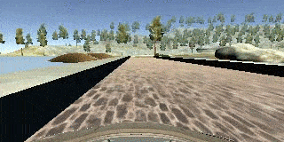

# **Behavioral Cloning** 


**Behavioral Cloning Project**

The goals / steps of this project are the following:

* Use the simulator to collect data of good driving behavior
* Build, a convolution neural network in Keras that predicts steering angles from images
* Train and validate the model with a training and validation set
* Test that the model successfully drives around track one without leaving the road
* Summarize the results with a written report


## Rubric Points
### Here I will consider the [rubric points](https://review.udacity.com/#!/rubrics/432/view) individually and describe how I addressed each point in my implementation.  

---
### Files Submitted & Code Quality

#### 1. Submission includes all required files and can be used to run the simulator in autonomous mode

My project includes the following files:

* model.py containing the script to create and train the model
* model.h5 containing a trained convolution neural network 
* writeup.md summarizing the results

#### 2. Submission includes functional code
Using the Udacity provided simulator and my drive.py file, the car can be driven autonomously around the track by executing 
```sh
python drive.py model.h5
```

#### 3. Submission code is usable and readable

The model.py file contains the code for training and saving the convolution neural network. The file shows the pipeline I used for training and validating the model, and it contains comments to explain how the code works.

### Model Architecture and Training Strategy

#### 1. An appropriate model architecture has been employed

My model is inspired by the structure introduced [here](https://developer.nvidia.com/blog/deep-learning-self-driving-cars/) with some adjustments (line 105-127)

It consists of 3 conv layers with 5x5 filter size and depths between 3 to 48, I also added 2x2 maxpool layers in between those conv layers; then followed by 2 conv layers with 3x3 filter size; followed by 4 FC layers with size 100, 50, 10, 1 and dropout layers in between (except between 10 and 1).

It uses ReLU as the activation function throughout to introcude non-linearity.

For pre-processing, the images are normalized (107) and cropped (106) to focus on the interestring reigon.


#### 2. Attempts to reduce overfitting in the model

The model contains dropout layers

We use 80/20 training/validation data split to make sure model does not overfit.

#### 3. Model parameter tuning

The model used an adam optimizer, so the learning rate was not tuned manually (model.py line 129).

#### 4. Appropriate training data

I used the provided training data to train the baseline driving behavior, and collected few more sets to address certain scenarios/driving behavior (details below)

* make sharper turns
* recovering from edges of the road to the center

### Model Architecture and Training Strategy

#### 1. Solution Design Approach

I started with the architecture presented by the [nvidia team](https://developer.nvidia.com/blog/deep-learning-self-driving-cars/) as it's a proven working solution to handle real world driving situations, it should be more than sufficient to handle scenarios in a simulator, and the provided training data to get a base model and see how that performs.

The training result shows higher validation error, so I added dropout layers to counter that.

As for the driving performance, it drives normally on straight road, but does not turn enough on turns, I suspect it's due to we don't have enough data on turns so it tends to drive straight as most of the training data are on straight roads; also onces it's slightly off to the edge, it can't return back, also due to lack of samples of returning to the center from the edge.

So then I collected segments to address these 2 issues. I collected some segments of driving around turns; and a long run of swerving around, then I deleted segments of the driving where the car goes towards the edge and only kept the part where it returns from the edge back to the center.

With these additional data, I trained the model with the same architechture (with dropout) for 10 epochs, and the result model is good enough to drive the car around the track. Though in some parts it presents non-ideal driving pattern (like on the bridge, it tends to go left on the first half and go right on the second half, very like also due to lack to training samples and I didn't do very well manually when collecting the clips on that part), I believe it can still improve presented more diverse data, but this is good enough for the track in this case.

#### 2. Final Model Architecture

Model is explained in the first section in "Model Architecture and Training Strategy".

#### 3. Creation of the Training Set & Training Process

I explained my data collection strategy in section 1 above. I'll present some samples here

Here're some sample images from the segments for capturing turns:


And here's a sequence of recovering from the side of the road




This gives additional ~500+ more center images for in-turn actions and ~1000 center images for recovery action.

I finally combined this additional set with the provided training data, randomly shuffled the data set and put 20% of the data into a validation set.

I trained the model for 10 epochs but the validation accuracy stayed relatively stable after 5 epochs.