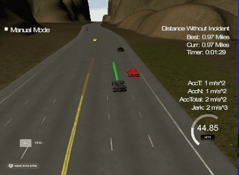
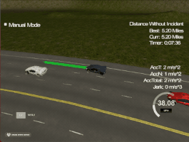
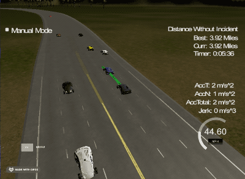

# CarND-Path-Planning-Project
Self-Driving Car Engineer Nanodegree Program
   

## State estimation

I use remaining path points to estimate ego car's state at the end of the existing path (velocity and acceleration), and use tranformation to get its X,Y location.

For traffic vehicles, I keep a time in between measurements, combining with observed velocity I can estimate the accelerations, with measured speed and location, I can estimate their location and speed when ego car reach the end of current path.

These predicted states will be used for behaviro planning.

## Behavior planning

I only have 3 states in FSM: KL (keep lane), LLS (left lane shift), RLS (right lane shift).

KL can transit to all 3 states (with some restrictions to lane change state)

LLS and RLS have to change to KL.

KL can only change to lane change if ego car has stayed near the center of the lane (`ego.target_lane*4.0-1.8 and ego.target_lane*4.0+2.2`) for enough cycles, tracked by a counter. And right after transiting to a lane change state, the counter is reset.

Lane change state will update ego car's target lane to the result lane, which will be used for trajectory generation.

To get the optimal choice for next state, I consider 3 factors:

1. target lane speed (to optimize for higher speed)
2. lane change cost (avoid regularly changing lanes, only change when the speed gain is worth it)
3. the gap between ego car and leading car in the target lane (optimize for longer runway)
4. feasibility check (explained below)

To check if a plan is feasible, KL is always feasible, for changing lanes, we need to not go out of bound and avoid collision:

1. left most lane can't change left and right most lane can't change right
2. scan through all traffic cars in the target lane, check s corrdinate, if it's within certain range of the ego car (some meters ahead and some meters behind) then consider the lane blocked.

## Trajectory generation

Based on the target_lane generated in the previous step, we can generate a path in 2 steps: use quint polynomial to generate jerk minimizing path longitudinally, then use spline to fit a path towards the target_lane, then use the quint polynomial to estimate the speed at each point on the path to generate a trajectory.

In the target_lane, look for a leading vehicle within certain range, if any car found, we'll adopt following car policy, otherwise, adopt keep speed policy. Referencing the paper [Optimal Trajectory Generation for Dynamic Street Scenarios in a Frenet Frame](https://www.researchgate.net/publication/224156269_Optimal_Trajectory_Generation_for_Dynamic_Street_Scenarios_in_a_Frenet_Frame) to determine the goal state for following/keep speed to generate quint polynomial.

Then, using the last 2 points in the previous path, and 30, 60, 90 m ahead in the target lane to generate the spline path. I translate these point to the car's corrdinate system then fit the spline path.

Along the path, with constant 0.02s time gap, calculate the speed at current point, break it apart in x,y direction based on the current heading, increment x value, then fit on the spline path, the result will be used as the next point (heading will be updated as well). Along the way, speed will be capped at speed limit, and speed change will be capped at max acceleration to make sure we don't violate these rules. Resulting points will be translated back to the map x,y value and return.

## Examples

Result is pretty good, car can drive multiple loops around the track without any incident

Keep speed

Follow leading car

Lane change

Following car at low speed, make a lane change then speed up

